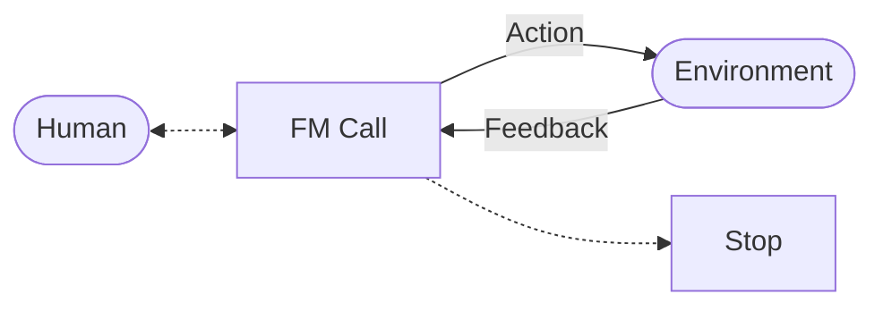
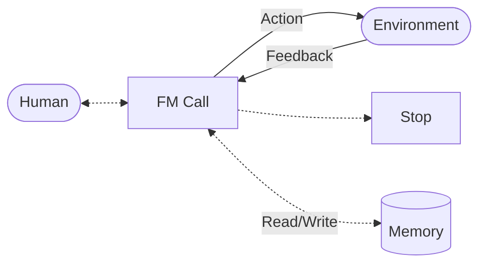

# Agents

- [Introduction](#introduction) - [Workflows](../workflows/README.md) VS [Agents](#agents-1)
- [Agents](#agents-1)
- [Levels of Agency](#levels-of-agency)
- [Agentic Systems](#agentic-systems)
- [Middleware](#middleware)
- [Graphical User Interfaces](#graphical-user-interfaces)

## Introduction

Agents or agentic systems can be defined in several ways. I'll reference Anthropic's [Building Effective Agents](https://www.anthropic.com/engineering/building-effective-agents) well-written (Dec 2024) blog post by Schluntz et al. here. At one end of the spectrum we have the **highly autonomous** definition, *fully autonomous systems that operate independently over extended periods, using various tools to accomplish complex tasks*, at the other we have the **prescriptive implementations** that *follow predefined workflows*. In the Anthropic definition, they draw the line between **workflows** and **agents**:

- [**Workflows**](../workflows/README.md) are systems where FMs and tools are orchestrated through predefined code paths, workflows offer predictability and consistency for well-defined tasks, while,
- [**Agents**](#agents-1) are systems where FMs dynamically direct their own processes and tool usage, maintaining control over how they accomplish tasks. Agents are the better option when flexibility and model-driven decision-making are needed at scale.

I also wrote down some of my own thoughts on agents in an internal blog post in Dec 2024 (before the Anthropic post). Some "out-of-context" excerpts:

> **Find Working Agentic Workflows 🤖** - Some of you might know that I’ve been a (sometimes vocal) critic of early agent-based work. My biggest issue was that the problems various agencies were trying to solve with agentic workflows tended to feel to me like Maslow's famous quote “If the only tool you have is a hammer, you tend to see every problem as a nail” (i.e. better data, fine-tuning, RAG and reasoning approaches would work better and faster in many of those cases). I do believe that foundation model (FM) agents have huge potential, especially when we figure out how to build better human-AI partnerships (I hope to eventually pen down some thoughts on this area). Here, I wanted to explore if there were worthy applications of agentic workflows in this AI app I was building.

> **Or Not** - My definition of an FM agent is something that has "agency", so if you have two or more FM agents interacting with each other in a loop with some exit conditions, thats an agentic system with agents. Their agency is to interact (within constraints) with each other. You could also have a loop with one or more agents and an app or (sandbox) environment, that would also be an agentic system where the agent(s) have agency over actions in that environment. Having an FM run multiple generations like planning, writing content and checking it in a workflow with some glue code in between doesn’t really qualify as agentic - so I’d call that an FM workflow instead. If my app needs an FM workflow, I’d rather give it that then bring in the agentic "hammer".

So very similiar to the Anthropic definition, agents with "agency" **dynamically direct their own processes and tool usage, maintaining control over how they accomplish tasks**. Concretely, to "maintain control", there's probably a need to define constraints or exit conditions, where you *reap the fruits of the agents labour*.

> When building applications with LLMs, we recommend finding the simplest solution possible, and only increasing complexity when needed. This might mean not building agentic systems at all. Agentic systems often trade latency and cost for better task performance, and you should consider when this tradeoff makes sense. - Erik Schluntz and Barry Zhang, Anthropic

On the other hand, [**workflows**](../workflows/README.md) could be super productive and be what we actually need.

## Agents

Agents can handle sophisticated tasks, but their implementation is often straightforward. They are typically just FMs using tools to perform actions based on environmental feedback in a loop. Such an agent loop can be visualized in a graph as shown below.



Or if you prefer it implemented in pythonic pseudo-code, here you go.

```python
env = Environment()
tools = Tools(env)
system_prompt = "Goals, constraints, and how to act"

while True:
    action = fm.call(system_prompt + env.feedback)
    env.feedback = tools.run(action)
```

A useful extension to our above agent loop is being able to augment our FM (or FM call) with memory. FM context windows (a limitation on the maximum amount of data an FM can input) means that agents that require a lot of information to be processed can quickly exceed the the size of the context window. Memory systems (both short-term and long-term) help an agent to manage its context effectively. This augmentation is visualized in the diagram below.



We could augment our python pseudo-code accordingly:

```python
memory = Memory
env = Environment()
tools = Tools(env)
system_prompt = "Goals, constraints, and how to act"

while True:
    action = fm.call(system_prompt + env.feedback + memory.retrieve(env.feedback))
    env.feedback = tools.run(action)
    memory += [action, env.feedback]
```

## Levels of Agency

We borrow the classification by Hugging Face's smolagents team for [levels of agency](https://huggingface.co/blog/smolagents), which they define as the influence of the FM's input on the agentic loop (code workflow) is the level of agency of the FM in the system.

The table below illustrates how agency varies across systems:

| Agency Level | Description | How that's called | Example Pattern |
| --- | --- | --- | --- |
| ☆☆☆ | LLM output has no impact on program flow | Simple processor | `process_llm_output(llm_response)` |
| ★☆☆ | LLM output determines basic control flow | Router | `if llm_decision(): path_a() else: path_b()` |
| ★★☆ | LLM output determines function execution | Tool call | `run_function(llm_chosen_tool, llm_chosen_args)` |
| ★★★ | LLM output controls iteration and program continuation | Multi-step Agent | `while llm_should_continue(): execute_next_step()` |
| ★★★ | One agentic workflow can start another agentic workflow | Multi-Agent | `if llm_trigger(): execute_agent()` |

So following on our previous definition, we probably can draw the line at ★☆☆ and ★★☆ being [workflows](../workflows/README.md) and ★★★ having the level of agency of an agentic system.

## Agentic Systems

Agentic systems often comprise multiple AI agents that work in concert, leveraging the capabilities of Foundation Models (FMs) to tackle complex problems.

- [LangManus](prompts/langmanus/README.md) - AI automation framework that combines language models with specialized tools for tasks like web search, crawling, and Python code execution. Open source clone of [Manus AI](https://manus.im/).
    - [Prompts](prompts/langmanus/) - Coordinator, Planner, Supervisor, Researcher, Coder, Browser and Reporter Agents.

## Middleware

- [Model Context Protocol (MCP)](middleware/mcp.md) - A middleware layer, a kind of standardized integration layer, for agents. It provides agents with (standardized, secure and structured) plumbing to connect and perform actions involving external data or tools.

## Graphical User Interfaces

- [Rivet](https://github.com/Ironclad/rivet) - a graphical user interface and development environment for creating complex AI agents and prompt chaining, and embedding it in your application.


## References

- [OpenAI Swarm](https://github.com/openai/swarm)
- [crewAI](https://github.com/crewAIInc/crewAI)
- [LangChain Agents](https://python.langchain.com/docs/how_to/#agents)
- [Phidata](https://docs.phidata.com/introduction)
    - [Instructions](https://github.com/phidatahq/phidata/blob/main/phi/agent/agent.py#L930)
    - [Transfer Prompt, e.g. Tools](https://github.com/phidatahq/phidata/blob/main/phi/agent/agent.py#L436)
- [Search-o1](https://github.com/sunnynexus/Search-o1)
    - [Prompts](https://github.com/sunnynexus/Search-o1/blob/main/scripts/prompts.py)
- [khoj](https://github.com/khoj-ai/khoj) - Self-hostable AI second brain. Get answers from the web or your docs. Build custom agents, schedule automations, do deep research. 
    - [Prompts](https://github.com/khoj-ai/khoj/blob/master/src/khoj/processor/conversation/prompts.py)
- [Anthropic's Building Effective Agents Cookbook](https://github.com/anthropics/anthropic-cookbook/tree/main/patterns/agents)