# Function Calling

The following example is a function calling flow (from OpenAI's [function calling API](https://platform.openai.com/docs/guides/function-calling) but largely the standard for tool use/function calling) between a developer and a model which is given access to tools (functions). The developer executes the function code, sends back the results, and the model will incorporate them into its final response.

```mermaid
sequenceDiagram
    participant Developer
    participant Model

    Developer->>Model: 1. Tool Definitions + Messages<br>get_weather(location)<br>What's the weather in Paris?
    Model-->>Developer: 2. Tool Calls<br>get_weather("paris")
    Note over Developer: 3. Execute Function Code<br>get_weather("paris")
    Note over Developer: Result: {"temperature": 14}
    Developer->>Model: 4. Results<br>All Prior Messages<br>{"temperature": 14}
    Model-->>Developer: 5. Final Response<br>It's currently 14°C in Paris.
```

