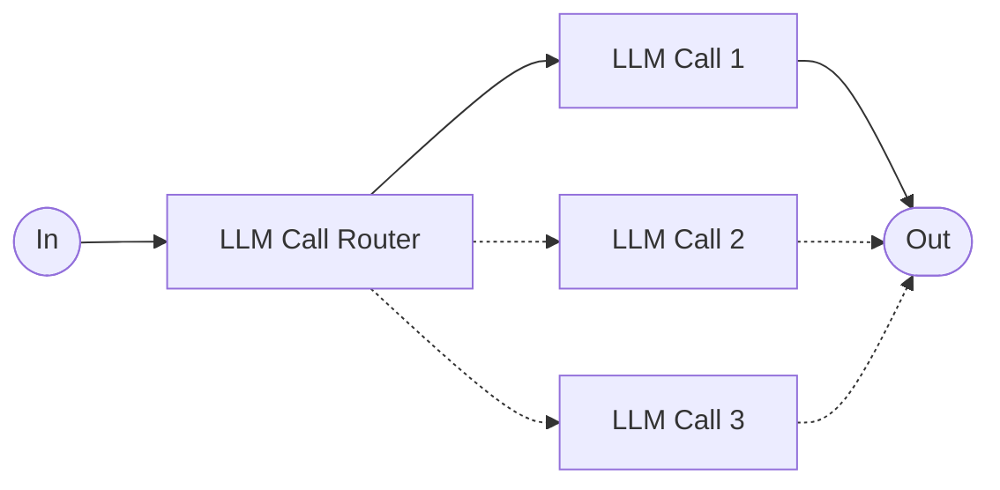

# Workflows

Workflows are systems where LLMs and tools are orchestrated through predefined code paths. They offer predictability and consistency for well-defined tasks.

### Routing

The above workflows heavily reference Anthropic's [Building Effective Agents](https://www.anthropic.com/engineering/building-effective-agents) blog post by Schluntz et al. (Dec 2024).