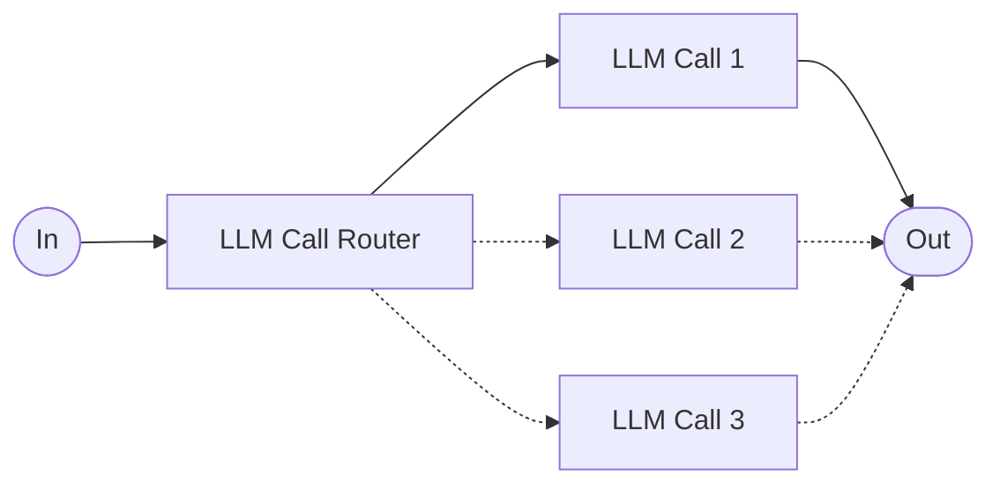

# Workflows

Workflows are systems where FMs and tools are orchestrated through predefined code paths. They offer predictability and consistency for well-defined tasks.

### Routing

The routing workflow first classifies an input (`In`) with an `LLM Call Router` and directs it to a specialized followup task (e.g. `LLM Call 1`). This workflow allows for separation of concerns, and building more specialized prompts. Without this workflow, optimizing for one kind of input can hurt performance on other inputs.

**When to use this workflow**: Routing works well for complex tasks where there are distinct categories that are better handled separately, and where classification can be handled accurately, either by an LLM or a more traditional classification model/algorithm (e.g. a BERT model with a classification head or even a classical machine learning model).

Examples where routing is useful:

1. My team used a routing workflow for one of our QA chatbots. The call router was a supervised BERT model (eventually replaced by a more performant and low-cost smol LLM) doing [Dialogue Act Classification (DAC)](https://paperswithcode.com/task/dialogue-act-classification), where we differentiated whether the query/question required retrieval from a RAG system, did not require retrieval (i.e. was a follow up question that could be answered with previous context) or was irrelevant to this chatbot's domain. Then the query was routed to a separate downstream process (`LLM Call x`).
2. Directing different types of customer service queries (general questions, refund requests, technical support) into different downstream processes, prompts, and tools.
3. Routing easy/common questions to smaller models (less capable LLMs) and hard/unusual questions to more capable models (Frontier models) to optimize cost and speed.

The above workflows heavily reference Anthropic's [Building Effective Agents](https://www.anthropic.com/engineering/building-effective-agents) blog post by Schluntz et al. (Dec 2024).