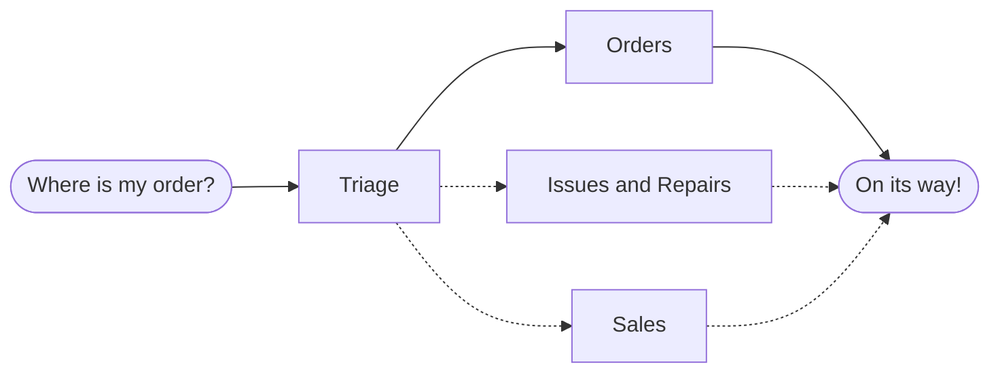

# Workflows

Workflows are systems where Foundation Models (FMs) and tools are orchestrated through predefined code paths. They offer predictability and consistency for well-defined tasks.

Note: I use Foundation Models (FMs) to represent the superset which includes LLMs, Large Multimodal Models (LMMs) like Vision Language Models (VLMs) or other models involving speech, video or other forms.

1. [Prompt Chaining](#prompt-chaining)
2. [Routing](#routing)
3. [Parallelization](#parallelization)
4. [Orchestrator-Workers](#orchestrator-workers)
5. [Evaluator-Optimizer](#evaluator-optimizer)

### Prompt Chaining

Prompt chaining decomposes a task into a sequence of steps, where each FM call processes the output of the previous call. You can add programmatic checks (e.g. `gate` in the diagram below) on any intermediate steps to ensure that the process is still on track.

**When to use this workflow**: This workflow is ideal for situations where the task can be easily and cleanly decomposed into fixed subtasks. The main goal is to trade off latency for higher accuracy, by making each FM call an easier task.


Examples where prompt chaining is useful:

1. Generating Marketing copy, then translating it into a different language.
2. Writing an outline of a document, checking that the outline meets certain criteria, then writing the document based on the outline.

### Routing

The routing workflow first classifies an input (`In`) with an `FM Call Router` and directs it to a specialized followup task (e.g. `FM Call 1`). This workflow allows for separation of concerns, and building more specialized prompts. Without this workflow, optimizing for one kind of input can hurt performance on other inputs.


**When to use this workflow**: Routing works well for complex tasks where there are distinct categories that are better handled separately, and where classification can be handled accurately, either by an FM or a more traditional classification model/algorithm (e.g. a BERT model with a classification head or even a classical machine learning model).

Examples where routing is useful:

1. My team used a routing workflow for one of our QA chatbots. The call router was a supervised BERT model (eventually replaced by a more performant and low-cost smol FM) doing [Dialogue Act Classification (DAC)](https://paperswithcode.com/task/dialogue-act-classification), where we differentiated whether the query/question required retrieval from a RAG system, did not require retrieval (i.e. was a follow up question that could be answered with previous context) or was irrelevant to this chatbot's domain. Then the query was routed to a separate downstream process (`FM Call x`).
2. Directing different types of customer service queries (general questions, refund requests, technical support) into different downstream processes, prompts, and tools.
3. Routing easy/common questions to smaller models (less capable FMs) and hard/unusual questions to more capable models (Frontier models) to optimize cost and speed.

In OpenAI's ["A practical guide to building agents" (Apr 2025)](https://cdn.openai.com/business-guides-and-resources/a-practical-guide-to-building-agents.pdf), they introduce a **decentralised pattern** and give the following example of a customer service workflow:



This decentralized pattern is similar to the routing pattern we talked about, except in OpenAI's definition, each component, the `Triage`, `Orders` etc. are "agents" that can "handoff" workflow execution to one another. Handoffs are a one way transfer that allow an agent to delegate to another agent. For example, a handoff is done by tool use or function calling. If an agent (e.g. `Triage`) calls a handoff function, execution and the latest conversation state is transferred to that agent (e.g. `Orders`). 

This pattern involves using many agents on equal footing, where one agent can directly hand off control of the workflow to another agent. This is optimal when you don't need a single agent
maintaining central control or synthesis—instead allowing each agent to take over execution and interact with the user as needed. The difference from the routing pattern scope as an AI workflow is that each of the agents in the decentralised pattern can interact with the user and might represent a set of FM calls instead of a single one - its a broader definition of the routing pattern.

<details>
<summary>Code for Decentralised Pattern with OpenAI's Agents SDK</summary>

```python
from agents import Agent, Runner

technical_support_agent = Agent(
    name="Technical Support Agent",
    instructions=(
        "You provide expert assistance with resolving technical issues, "
        "system outages, or product troubleshooting."
    ),
    tools=[search_knowledge_base]
)

sales_assistant_agent = Agent(
    name="Sales Assistant Agent",
    instructions=(
        "You help enterprise clients browse the product catalog, recommend "
        "suitable solutions, and facilitate purchase transactions."
    ),
    tools=[initiate_purchase_order]
)

order_management_agent = Agent(
    name="Order Management Agent",
    instructions=(
        "You assist clients with inquiries regarding order tracking, "
        "delivery schedules, and processing returns or refunds."
    ),
    tools=[track_order_status, initiate_refund_process]
)

triage_agent = Agent(
    name="Triage Agent",
    instructions="You act as the first point of contact, assessing customer queries and directing them promptly to the correct specialized agent.",
    handoffs=[technical_support_agent, sales_assistant_agent, order_management_agent]
)

Runner.run(
    triage_agent,
    input("Could you please provide an update on the delivery timeline for our recent purchase?")
)
```

</details>


### Parallelization

The parallelization workflow puts FMs to work simultaneously on a task and have their outputs aggregated programmatically. There are 2 key variations:

- **Sectioning**: Breaking a task into independent subtasks run in parallel.
- **Voting**: Running the same task multiple times to get diverse outputs.


**When to use this workflow**: Parallelization is effective when the divided subtasks can be parallelized for speed, or when multiple perspectives or attempts are needed for higher confidence results (combining multiple generations can lead to a higher rate of success in solving the task, see the [pass@k metric](../../evaluation/metrics/pass@k.md)). For complex tasks with multiple considerations, FMs generally perform better when each consideration is handled by a separate FM call, allowing focused attention on each specific aspect.

Examples where parallelization is useful:

1. *Sectioning.* Implementing guardrails where one model instance processes user queries while another screens them for inappropriate content or requests. This tends to perform better than having the same FM call handle both guardrails and the core response.
2. *Sectioning.* Automating evals for evaluating FM performance, where each FM call evaluates a different aspect of the model’s performance on a given prompt.
3. *Voting.* Reviewing a piece of code for vulnerabilities, where several different prompts review and flag the code if they find a problem.
4. *Voting.* Evaluating whether a given piece of content is inappropriate, with multiple prompts evaluating different aspects or requiring different vote thresholds to balance false positives and negatives.

### Orchestrator-Workers

In the orchestrator-workers workflow, a central LLM dynamically breaks down tasks, delegates them to worker FMs (FM calls), and synthesizes their results.


**When to use this workflow**: This workflow is well-suited for complex tasks where you can’t predict the subtasks needed (in coding, for example, the number of files that need to be changed and the nature of the change in each file likely depend on the task). Whereas it’s topographically similar, the key difference from parallelization is its flexibility—subtasks aren't pre-defined, but determined by the orchestrator based on the specific input.

Example where orchestrator-workers is useful:

1. Coding products that make complex changes to multiple files each time.
2. Search tasks that involve gathering and analyzing information from multiple sources for possible relevant information.

### Evaluator-Optimizer

In the evaluator-optimizer workflow, one LLM call generates a response while another provides evaluation and feedback in a loop.


**When to use this workflow**: This workflow is particularly effective when we have clear evaluation criteria, and when iterative refinement provides measurable value. The two signs of good fit are, first, that FM responses can be demonstrably improved when a human articulates their feedback; and second, that the FM can provide such feedback. This is analogous to the iterative writing process a human writer might go through when producing a polished document.

Examples where evaluator-optimizer is useful:

1. Literary translation where there are nuances that the translator FM might not capture initially, but where an evaluator FM can provide useful critiques.
2. Complex search tasks that require multiple rounds of searching and analysis to gather comprehensive information, where the evaluator decides whether further searches are warranted.

The above workflows heavily reference Anthropic's [Building Effective Agents](https://www.anthropic.com/engineering/building-effective-agents) blog post by Schluntz et al. (Dec 2024).