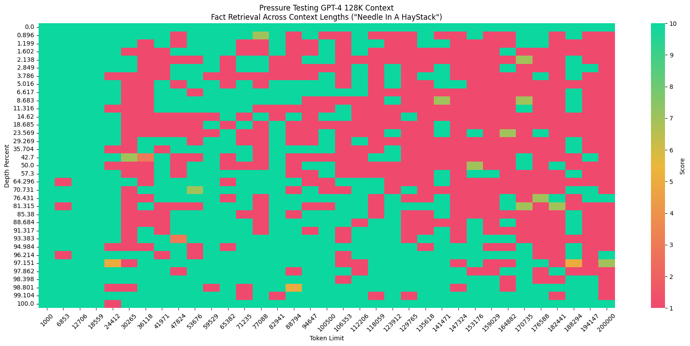

# NIH (Needle In a Haystack)

NIH or the Needle In a Haystack benchmark is an analysis to test in-context retrieval ability of long-context LLMs. It involves placing a random fact or statement (the 'needle') in the middle of a long context window (the 'haystack') and testing the models ability to retrieve this statement. The benchmark iterates over various document depths (where the needle is placed) and context lengths to measure performance. There is also a **multi-needle variant** which inserts the first needle at a `specified depth_percent`, then evenly distributes subsequent needles through the remaining context after this depth.

To create visualizations of the performance, the author provides a [notebook](https://github.com/gkamradt/LLMTest_NeedleInAHaystack/blob/main/viz/CreateVizFromLLMTesting.ipynb) that plots a visualization like the one below:

## Links

* Code: https://github.com/gkamradt/LLMTest_NeedleInAHaystack
* License: [MIT](https://github.com/gkamradt/LLMTest_NeedleInAHaystack/blob/main/LICENSE.txt)