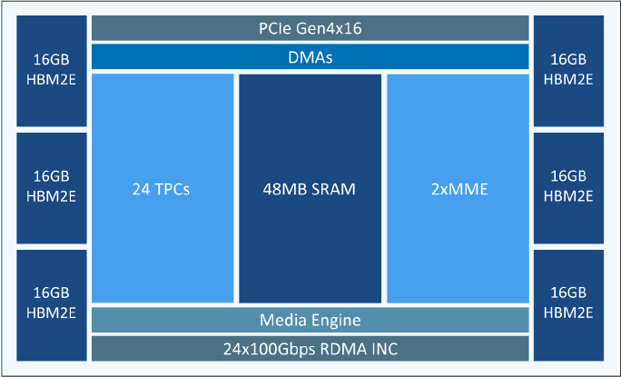
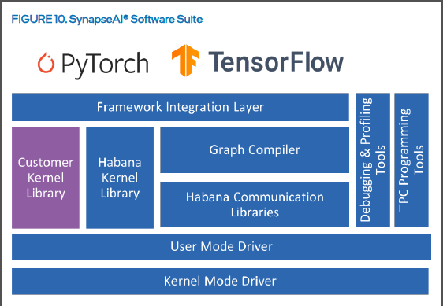

# Alternative Accelerators

| Model           | Manufacturer     | Process  | Transistors | Cores     | Performance        | SRAM  | HBM   | HBM Bandwidth    |
|-----------------|------------------|----------|-------------|-----------|--------------------|-------|-------|------------------|
| H100-SXM        | Nvidia           | TSMC 5nm | 80B         | 16896+528 | 990 TFLOPS (BF16)  | 50MB  | 80GB  | 3.35TBps (HBM3)  |
| GH200           | Nvidia           | TSMC 5nm | 80B         | 16896+528 | ?                  | ?     | 96GB 144GB | 3.35TBps (HBM3) ~5TBps (HBM3e) |
| [Gaudi2](#gaudi2)          | Habana           | TSMC 7nm | ?           | ?         | ?                  | 48MB  | 96GB  | 2.45TBps (HBM2e) |
| Gaudi3          | Habana           | TSMC 5nm | ?           | ?         | ?                  | ?     | ?     | Prob HBM2e            |
| MI300X          | AMD              | TSMC 5nm | 146B        | ?         | 383 TFLOPS (fp16)  | ?     | 192GB | 5.2TBps (HBM3)   |
| WSE-2           | Cerebras         | 7nm      | 2600B       | 850000    | 7500 TFLOPS (fp16) | 40GB  | -     | -                |
| SN40L           | SambaNova        | TSMC 5nm | 102B        | 1040      | 638 TFLOPS (bf16)  | 520MB | 64GB  | ?                |

Usually accelerators have "local" memory, co-located with the processing cores, usually SRAM which runs fast (e.g. in the A100s its about 20TBps bandwidth). They also have "global" memory which is accessible on the cards, usually High Bandwidth Memory (HBM). This is sometimes what we call our GPU VRAM.  HBM is an order of magnitude slower (e.g. about 2TBps bandwidth on the A100s (80GB) variants with HBM2e memory).

## Gaudi2

Gaudi2 chips are made by [Habana](https://habana.ai/) (which Intel acquired in Dec 2019). They are AI-only chips (no graphics features). As shown above, each Gaudi2 has two clusters with two types of compute engines – the Matrix Multiplication Engine (MME) cluster and the Tensor Processor Core (TPC) cluster. The MME (2xMME) is responsible for doing all operations which can be reduced to Matrix Multiplication (fully connected layers, convolutions, batched-GEMM) while the TPC (24xTPC), a Very Long Instruction Word (VLIW) Single Instruction Multiple Data (SIMD) processor, is used to accelerate other deep-learning operations.

The Gaudi2 chips also have on-chip networking (doesn't need to go over another network interface) in the form of 24x 100 Gbps RDMA Over Converged Ethernet (RoCE) V2 Remote Direct Access Memory (RDMA) network interface cards on chip. Hence, Gaudi-to-Gaudi communication intra-node can be via direct routing and over nodes can be over standard ethernet switching. Currently, this generation can go up to 400Gbps inter-node with ethernet, RoCE V2, which is comparable numbers to the current Mellanox NDR generation. Including intra-node communication, all-to-all operations for the Gaudi2 can reach 400Gbps speeds.

Memory-wise there is a 48 MB of local SRAM with sufficient bandwidth to allow MME, TPC, DMAs and RDMA NICs to operate in parallel. There is also 96GB of HBM2E memories delivering 2.45 TBps bandwidth. The High Bandwidth Memory (HBM) is what we commonly associate with our GPU VRAM (e.g. 80GB on the H100).

The [Gaudi2 whitepaper](https://habana.ai/wp-content/uploads/2023/10/Intel-Gaudi2-AI-Accelerators-whitepaper.pdf) is a good source of official information on the card.

### Intra-Node Connectivity

### Inter-Node Connectivity

### Software Stack

